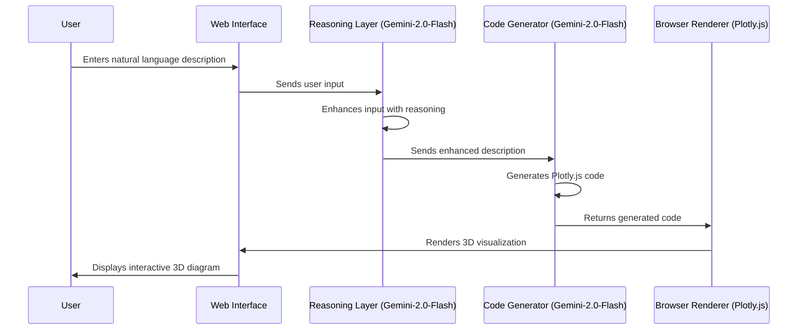

# Natural Language to 3D Diagram Web Application

## Overview

This web application transforms natural language descriptions into interactive 3D diagrams using AI. Users can input open-domain diagram descriptions in plain text, and the application renders them as interactive 3D visualizations.

🔗 [3D Diagram Genarator](https://natural-language-to-3d-diagram.vercel.app/) : https://natural-language-to-3d-diagram.vercel.app/

## Purpose

This application serves two primary functions:

- demonstrate 3d diagram generation

- Transform open-domain diagram descriptions into interactive 3D visualizations
- Enable real-time, in-browser rendering of complex vector diagrams and visualizations

## Architecture

## Current Limitations

1. **Model Constraints**: Gemini-2.0-Flash was not specifically designed for reasoning or code generation tasks
2. **JavaScript Generation**: LLMs generally perform better with Python than JavaScript, affecting code quality

## Proposed Improvements

- **Model Replacement**: Switch to Gemini-2.5-Pro, which offers superior code generation capabilities
- **Keep JavaScript**: No need to switch to Python as:
  - Browser-based rendering requires JavaScript
  - Gemini-2.5-Pro demonstrates strong JavaScript generation capabilities

## Implementation Benefits

By implementing these improvements, the application can provide:
- More reliable 3D visualizations
- Better handling of complex diagram requirements