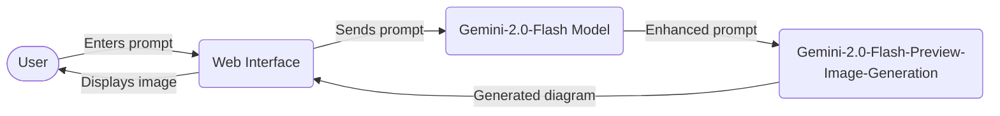

# 🖼️ Diagramic Image Generation Web Application

## WebApp: 

 [ Live ] : https://v0-image-generation-app-iota.vercel.app/  
 [ Repo ] : privete repo for now

## Application Overview

This interactive web application showcases the powerful capabilities of Google's `gemini-2.0-flash-preview-image-generation` model for creating sophisticated diagramic images across unlimited domains.

# Architecture Diagram

# How It Works

1. **User Input**: The user provides a text prompt describing the diagram they want to generate.

2. **Prompt Enhancement**: The input is sent to the `gemini-2.0-flash` model, which enhances the prompt according to best practices for high-quality image generation.

3. **Image Generation**: The enhanced prompt is then sent to the `gemini-2.0-flash-preview-image-generation` model to create a high-quality diagramic image.

4. **Image Preview**: The generated diagram is displayed to the user in the web interface.

# Technical Documentation

**Image generation Prompt Engineering guides** 
- [Image generation prompt engineering](https://cloud.google.com/vertex-ai/generative-ai/docs/image/img-gen-prompt-guide)
- [Image generation API usage](https://cloud.google.com/vertex-ai/generative-ai/docs/image/generate-images)