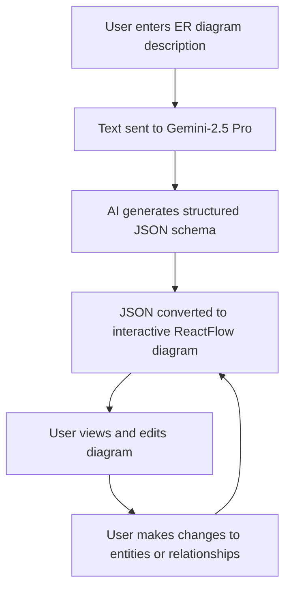

# 🖼️ ER Diagram Maker

## WebApp: 

 [ Live ] : https://er-diagram-generator.vercel.app/  
 [ Repo ] : https://github.com/AbQaadir/er-diagram-generator

___

An interactive application for transforming text descriptions into editable Entity-Relationship diagrams using AI.

## Purpose

ER Diagram Maker demonstrates how to leverage structured output from large language models to generate meaningful visual diagrams from text descriptions. The application showcases how AI can be used to bridge natural language and technical visualizations.

## Overview

ER Diagram Maker is a powerful tool that allows users to create and edit Entity-Relationship diagrams by simply describing their use case. The application leverages the Gemini-2.5 Pro model to interpret your description and generate a structured database schema, which is then visualized as an interactive diagram.

## Features

- **Natural Language to ER Diagram**: Convert plain text descriptions into detailed entity-relationship diagrams
- **Interactive Editing**: Modify entities, attributes, and relationships directly within the diagram
- **JSON Schema Generation**: Automatically generate structured JSON representations of your database schema
- **Dynamic Visualization**: See your database design come to life with an interactive flow diagram
- **Customizable Entities**: Edit attributes and relationships after generation

## How It Works

1. **Input**: Enter a description of your database or system
2. **AI Processing**: The Gemini-2.5 Pro model analyzes your description using chain-of-thought prompting
3. **Visualization**: The generated JSON schema is converted into an interactive diagram
4. **Editing**: Modify entities, attributes, and relationships through the user interface
