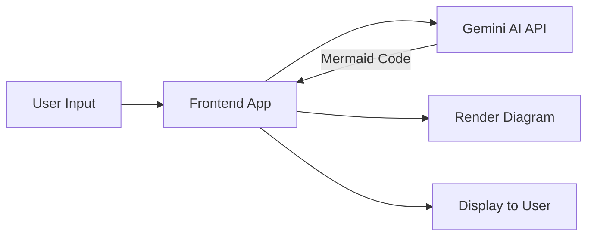

# Diagram creating using code generation

> **Note:** Unfortunately, I didn't deploy this artifact in the cloud for real-time demonstration. However, the local setup is available in the `local-apps` directory. 
>
> For similar functionality, you can try this alternative: [Presentation Diagram Generator by ShowMe](https://chatgpt.com/g/g-5QhhdsfDj-presentation-diagram-generator-by-showme/) which is well-suited for demonstration purposes.

This application transforms written use cases into visual diagrams using the Gemini AI model to generate Mermaid code, which is then rendered directly in the browser.

## Purpose

The purpose of this demonstration is creating diagrams using code generation and in-browser rendering.

## Demo

A demonstration video :  [artifect/mermaid.mp4](data%20artifect/mermaid.mp4).

## How It Works
1. User enters a use case description
2. Frontend calls Gemini API directly
3. Gemini returns Mermaid diagram code
4. Mermaid.js renders the diagram in the browser
5. User can view or export the result

## Architecture Diagram

The application is completely frontend-based with no backend requirements, making it lightweight and easily deployable on any static hosting service.
