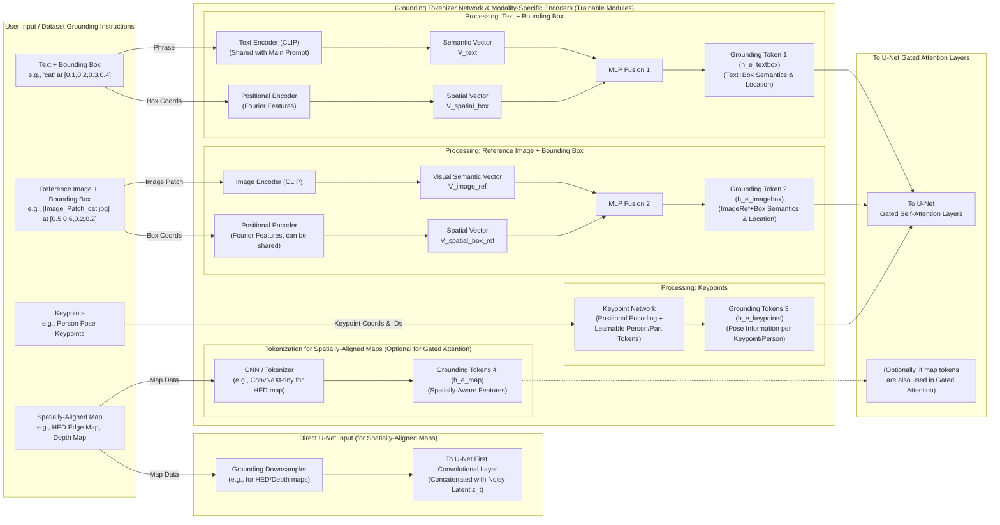

``` mermaid

graph LR
    subgraph "User Input / Dataset Grounding Instructions"
        direction TB
        GI_Text_Box["Text + Bounding Box<br/>e.g., 'cat' at [0.1,0.2,0.3,0.4]"]
        GI_Image_Box["Reference Image + Bounding Box<br/>e.g., [Image_Patch_cat.jpg] at [0.5,0.6,0.2,0.2]"]
        GI_Keypoints["Keypoints<br/>e.g., Person Pose Keypoints"]
        GI_Spatially_Aligned["Spatially-Aligned Map<br/>e.g., HED Edge Map, Depth Map"]
    end

    subgraph "Grounding Tokenizer Network & Modality-Specific Encoders (Trainable Modules)"

        subgraph "Processing: Text + Bounding Box"
            direction TB
            GI_Text_Box -- "Phrase" --> Enc_Text_CLIP["Text Encoder (CLIP)<br/>(Shared with Main Prompt)"]
            GI_Text_Box -- "Box Coords" --> Enc_Pos_Fourier["Positional Encoder<br/>(Fourier Features)"]
            Enc_Text_CLIP --> V_Text_Emb["Semantic Vector<br/>V_text"]
            Enc_Pos_Fourier --> V_Spatial_Emb_Box["Spatial Vector<br/>V_spatial_box"]
            V_Text_Emb --> MLP_Fusion_Text_Box["MLP Fusion 1"]
            V_Spatial_Emb_Box --> MLP_Fusion_Text_Box
            MLP_Fusion_Text_Box --> GT_TextBox["Grounding Token 1 (h_e_textbox)<br/>(Text+Box Semantics & Location)"]
        end

        subgraph "Processing: Reference Image + Bounding Box"
            direction TB
            GI_Image_Box -- "Image Patch" --> Enc_Image_CLIP["Image Encoder (CLIP)"]
            GI_Image_Box -- "Box Coords" --> Enc_Pos_Fourier2["Positional Encoder<br/>(Fourier Features, can be shared)"]
            Enc_Image_CLIP --> V_Image_Emb["Visual Semantic Vector<br/>V_image_ref"]
            Enc_Pos_Fourier2 --> V_Spatial_Emb_Box2["Spatial Vector<br/>V_spatial_box_ref"]
            V_Image_Emb --> MLP_Fusion_Image_Box["MLP Fusion 2"]
            V_Spatial_Emb_Box2 --> MLP_Fusion_Image_Box
            MLP_Fusion_Image_Box --> GT_ImageBox["Grounding Token 2 (h_e_imagebox)<br/>(ImageRef+Box Semantics & Location)"]
        end

        subgraph "Processing: Keypoints"
            direction TB
            GI_Keypoints -- "Keypoint Coords & IDs" --> Enc_Keypoint_Net["Keypoint Network<br/>(Positional Encoding +<br/>Learnable Person/Part Tokens)"]
            Enc_Keypoint_Net --> GT_Keypoints["Grounding Tokens 3 (h_e_keypoints)<br/>(Pose Information per Keypoint/Person)"]
        end

        subgraph "Tokenization for Spatially-Aligned Maps (Optional for Gated Attention)"
            direction TB
            GI_Spatially_Aligned -- "Map Data" --> Enc_Map_ConvNet["CNN / Tokenizer<br/>(e.g., ConvNeXt-tiny for HED map)"]
            Enc_Map_ConvNet --> GT_Spatially_Aligned["Grounding Tokens 4 (h_e_map)<br/>(Spatially-Aware Features)"]
        end

    end

    subgraph "To U-Net Gated Attention Layers"
        direction LR
        GT_TextBox --> U_Net_Input["To U-Net<br/>Gated Self-Attention Layers"]
        GT_ImageBox --> U_Net_Input
        GT_Keypoints --> U_Net_Input
        GT_Spatially_Aligned -.-> U_Net_Input_Optional["(Optionally, if map tokens<br/>are also used in Gated Attention)"]
    end

    subgraph "Direct U-Net Input (for Spatially-Aligned Maps)"
        GI_Spatially_Aligned -- "Map Data" --> Grounding_Downsampler["Grounding Downsampler<br/>(e.g., for HED/Depth maps)"]
        Grounding_Downsampler --> U_Net_FirstConv["To U-Net First Convolutional Layer<br/>(Concatenated with Noisy Latent z_t)"]
    end

```